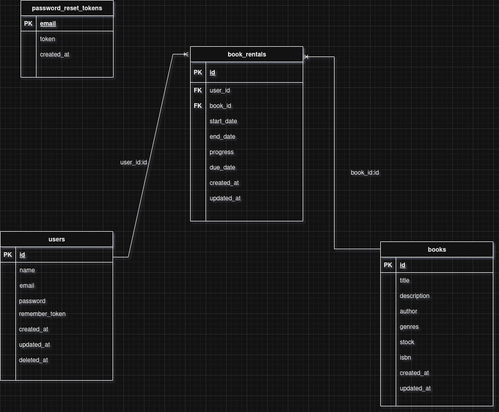

## Library API

A small API-only Laravel application for managing a library system using a DDD-style architecture, Sanctum authentication, and Redis-backed caching for read-heavy operations.

## Setup Instructions
### 1. Requirements
  - **PHP 8.2 +**
  - **Composer**
  - **MySQL**
  - **Redis for caching**

### 2. Clone and Install dependencies

```bash
git clone https://github.com/ipula/library-system-api.git library-system-api
cd library-system-api
composer install
```

### 3. Environment configuration

```bash
cp .env.example .env
```
##### Generate the app key:
```bash
php artisan key:generate

```
### 4. Database migration & seeding

```bash
php artisan migrate
php artisan db:seed
```
### 5. Redis (for caching)
```bash
docker run -d --name redis -p 6379:6379 redis:7
```
### 6. Run the application

```bash
php artisan serve
```
#### API will be accessible at:
```bash
http://localhost:8000/api/v1/{route}
```

## Architecture Overview
The project uses a Domain-Driven Design (DDD) style with clear separation between:

  - Domain – business rules and entities

  - Application – use cases (application services)

  - Infrastructure – Eloquent models, repositories, Redis, etc.

  - Interfaces – HTTP controllers, requests, Swagger docs

## Authentication
Authentication is API token–based using Laravel Sanctum.

- Users login via `/api/v1/login` and receive a Bearer token.
- Authenticated endpoints require header:``Authorization: Bearer {token}``
- Logout via ``/api/v1/logout`` which deletes the current token.
- Protected routes are wrapped with ``auth:sanctum`` middleware.

## API Endpoints
#### 1. Auth
``POST /api/v1/login``

Login with email & password.
    
**Body :**
```json
{
    "email": "user@example.com",
    "password": "secret123"
}
```
**Response :**
```json
{
    "token": "plain-text-sanctum-token",
    "token-type": "Bearer",
    "user": {
        "id": 1,
        "name": "User",
        "email": "user@example.com"
    }
}
```
``POST /api/v1/logout`` (auth required)
Revokes current token.

#### 2. Users

    POST /api/v1/users – register user (public)

    GET /api/v1/users – list users (auth)

    GET /api/v1/users/{id} – get one user (auth)

    PATCH /api/v1/users/{id} – update (auth)

    DELETE /api/v1/users/{id} – delete (auth; fails if user has active rentals)

Example **create user**:
```json
POST /api/v1/users
Content-Type: application/json

{
    "name": "John Doe",
    "email": "john@example.com",
    "password": "secret123",
    "password_confirmation": "secret123"
}
```
#### 3.  Books

    GET /api/v1/books – list books (with filters / pagination)

    GET /api/v1/books/{id} – show book

    POST /api/v1/books – create book

    PATCH /api/v1/books/{id} – update partially

    DELETE /api/v1/books/{id} – delete (fails if book has active rentals)

   - ##### GET /api/v1/books query params:
                page (int) – page number

                perPage (int) – items per page

                sortBy (title, author, isbn, availability)

                orderBy (asc, desc)

                genre (string) – filter by genre

                search (string) – search in title/author/isbn/genres

        Example :
        ```json
            GET /api/v1/books?perPage=10&page=1&sortBy=title&orderBy=asc&genre=fantasy&search=tolkien
            Content-Type: application/json
     
            {
                "data": [
                  {
                    "id": 1,
                    "title": "The Hobbit",
                    "author": "J.R.R. Tolkien",
                    "isbn": "1234567890",
                    "description": "...",
                    "genres": ["fantasy"],
                    "stock": 3,
                    "available": true
                  }
                ],
                "pagination": {
                    "current_page": 1,
                    "per_page": 10,
                    "total": 1,
                    "last_page": 1
                }
            }           
            
        ```
#### 4. Book Rentals
        POST /api/v1/rentBooks - rent a book for a user, reduce book stock

        GET /api/v1/getRentalReadingProgress/{rentalId} - get reading progress percentage

        PATCH /api/v1/rentExtend/{rentalId} - extend due date (must be later than current, cannot extend finished rental)

        PATCH /api/v1/updateRentProgress/{rentalId} - update reading progress (0–100, cannot update finished rental)

        PATCH /api/v1/rentFinish/{rentalId} - finish rental (sets end date + progress = 100)

Example **create book rental**:
```json
POST /api/v1/rentBooks
Content-Type: application/json

{
    "book_id": 10 // set automatic due date for 2 weeks
}
```

### Design Decisions
#### DDD-style architecture
Pros:
- Clean separation between business logic (Domain), use cases (Application), and infrastructure (Eloquent, Redis)
- Easy to write unit tests
- Thin Controllers
- Not depend on the framework


  Cons:
- Might feel like not suitable for small project

#### Custom Domain Exceptions

- Clean JSON errors
- Consistent status codes (422, 404, etc.)

#### Sanctum for API auth

- Simple, easy developments.
- Recommended By Laravel 

### References

Domain-Driven Design 
- [link 1](https://dev.to/blamsa0mine/building-a-scalable-laravel-application-with-domain-driven-design-ddd-42j6)
- [link 2](https://medium.com/@harryespant/implementing-domain-driven-architecture-in-laravel-setup-advantages-and-practical-use-cases-5eac6dfeffaa)

Cashing

- [link 1](https://medium.com/@zulfikarditya/advanced-laravel-caching-techniques-with-redis-299ab43e09dd)
- [link 2](https://laravel.com/docs/12.x/redis)

Unit Testing

- [Link 1](https://ondrej-popelka.medium.com/fixture-testing-in-phpunit-90bd52fa77be)
- [Link 2](https://laravel.com/docs/12.x/testing)

### Entity Relationship Diagram



### Postman Collection

- [Collection](./docs/Library-system.postman_collection.json)
- [Collection ENV](./docs/Library-system.postman_environment.json)
